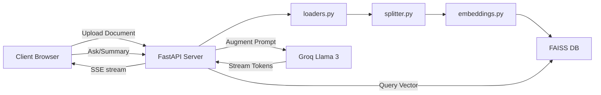

# Functional Requirements Document (FRD)

## Project Name: DocuMind RAG

---

## 1. System Architecture



---

## 2. API Endpoint Specifications

### 2.1 File Upload
- **URL**: `/upload`
- **Method**: `POST`
- **Content-Type**: `multipart/form-data`
- **Request Body**:
  - `file`: Binary file (PDF, PPT, or PPTX).
- **Responses**:
  - **200 OK**:
    ```json
    {
      "status": "success",
      "document_id": "8b5cf6e9e9f64bbfa88b5cf6e9e9f64b",
      "filename": "annual_report.pdf",
      "questions": [
        "What was the total revenue in Q4?",
        "What are the main risks outlined in section 3?",
        "What was the growth rate of Amazon EC2?",
        "What predictions are made for 2027?",
        "Who is the lead auditor for the company?"
      ]
    }
    ```
  - **400 Bad Request** (Invalid format):
    ```json
    {
      "detail": "Only PDF and PPT files are supported."
    }
    ```
  - **500 Internal Server Error**:
    ```json
    {
      "detail": "Something went wrong during document processing. Please try again."
    }
    ```

---

### 2.2 Ask Question (Streaming)
- **URL**: `/ask`
- **Method**: `POST`
- **Content-Type**: `application/json`
- **Request Body**:
  ```json
  {
    "document_id": "8b5cf6e9e9f64bbfa88b5cf6e9e9f64b",
    "question": "What is Amazon EC2?"
  }
  ```
- **Response**: Server-Sent Events (SSE) stream (`text/event-stream`).
  - **Events format**:
    - Chunk token:
      ```text
      data: {"token": "Amazon "}
      
      data: {"token": "EC2 "}
      
      data: {"token": "is a web service..."}
      ```
    - Final completion metadata containing sources:
      ```text
      data: {"source": "Page 12, Page 15", "done": true}
      ```
  - **Error Case (404 Not Found)**:
    ```json
    {
      "detail": "Document not found. Please upload the file first."
    }
    ```

---

### 2.3 Document Summary
- **URL**: `/summary`
- **Method**: `POST`
- **Content-Type**: `application/json`
- **Request Body**:
  ```json
  {
    "document_id": "8b5cf6e9e9f64bbfa88b5cf6e9e9f64b"
  }
  ```
- **Responses**:
  - **200 OK**:
    ```json
    {
      "summary": "This document provides a comprehensive overview of cloud resource planning. Key points include...\n- Elastic computing scalability\n- Security guardrails\n- Cost optimization algorithms."
    }
    ```
  - **404 Not Found**:
    ```json
    {
      "detail": "Document not found. Please upload it first."
    }
    ```

---

## 3. RAG Guardrail and Pipeline Rules

### 3.1 Text Processing
- **Text Chunk size**: `800` characters.
- **Overlap**: `150` characters.
- **Metadata fields appended to chunks**:
  - `source`: Filename.
  - `page`: 1-indexed page number (PDF) or slide number (PPT/PPTX).
  - `type`: File extension category (`pdf` or `pptx`).

### 3.2 Confidence Check Threshold
- **Relevance Metric**: Cosine Similarity.
- **Similarity Threshold**: `0.4` (on a `[0, 1]` scale).
- **Evaluation Rule**:
  $$\max(\text{relevance\_scores}) \ge 0.4$$
  If this evaluates to `False`, retrieve no further context, skip Groq query, stream exactly:  
  `"Sorry, this information is not available in the uploaded document."` and yield source as `"N/A"`.

### 3.3 System Prompt Enforcement
The model is prompted to answer strictly based on the text context provided. If the LLM generates a refusal message (e.g., "I cannot find this info"), the backend overrides the source citation to `"N/A"`.
