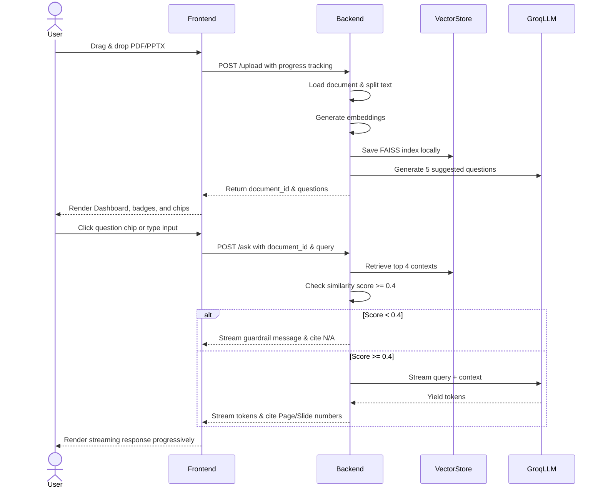

# Product Requirements Document (PRD)

## Project Name: DocuMind RAG

---

## 1. Executive Summary
DocuMind RAG is a production-ready Document Question-Answering web application. It allows users to upload PDF and PPT/PPTX documents and ask questions about their contents. The system utilizes Retrieval-Augmented Generation (RAG) with local vector databases and the Groq Llama 3 API to generate answers. 

A primary constraint of this application is a **Strict RAG Guardrail**: the assistant must ONLY answer using information found within the uploaded document and never hallucinate or draw from outside knowledge.

---

## 2. Product Features

### 2.1 File Upload
- **Supported Formats**: `.pdf`, `.ppt`, `.pptx`.
- **Validation**: Strict format validation on the frontend and backend.
- **Upload Progress**: Real-time progress bar tracking file uploading from client to server.

### 2.2 Document Processing Pipeline
1. **Document Loading**: PyPDFLoader for PDFs; slide-by-slide shape parser (`python-pptx`) for PowerPoint files.
2. **Text Chunking**: Recursive character splitting to preserve contextual semantic blocks.
3. **Embeddings Generation**: Encode text chunks locally using the HuggingFace `all-MiniLM-L6-v2` Sentence Transformer.
4. **Vector Storage**: Build and store a FAISS index locally on disk indexed by `document_id`.
5. **Citations & References**: Map and persist source markers (`Page X` or `Slide X`) on every chunk.

### 2.3 Strict RAG Guardrails & Confidence Check
- **Prompt Guardrail**: System prompt forcing the model to only answer using provided context. If the answer is not present, it must answer exactly:  
  `"Sorry, this information is not available in the uploaded document."`
- **Similarity Scoring**: Retrieve top chunks and calculate a relevance score. If the maximum similarity score falls below a configurable threshold (default `0.4`), the backend immediately aborts LLM generation and returns the guardrail response.

### 2.4 Chat Interface
- Modern, clean ChatGPT-like interface.
- Progressive token-by-token streaming response.
- Source Citation badges displaying Page/Slide numbers.
- Auto-scroll to bottom of chat container on new content.
- Shift-Enter for newlines, Enter to send.

### 2.5 Suggested Questions
- After document analysis, the backend uses the LLM to inspect text chunks and generate 5 relevant questions.
- Displayed on the UI as clickable chips that immediately send the question to the AI.

### 2.6 Document Summary
- A "Generate Summary" button allows users to get a concise summary of the uploaded document.
- Handles large documents by representative sampling (head, middle, tail chunks) to prevent LLM context-window limits.

---

## 3. Tech Stack

- **Frontend**: React.js, Tailwind CSS (v3), Axios, React Router, Lucide Icons.
- **Backend**: Python FastAPI, LangChain, FAISS, Sentence Transformers, Groq API (Llama 3), python-pptx, PyPDF.

---

## 4. User Flow

---

## 5. Non-Functional Requirements
- **Performance**: Embeddings and chunking should process a 10-page document in under 5 seconds.
- **Security**: Upload files are validated by extension; deserialization of FAISS index is isolated by session `document_id`.
- **UX/Design**: Modern SaaS aesthetic with glassmorphism, responsive grid layout, and smooth animations.
